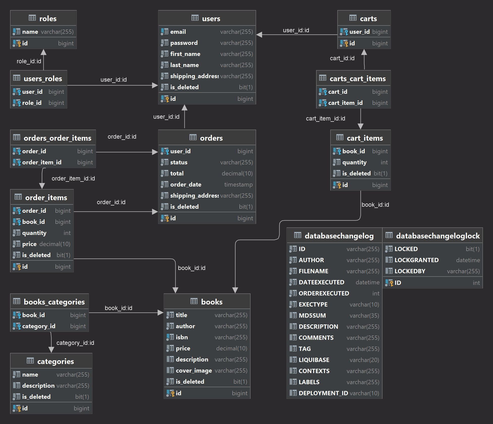

<body>
    <header>
        
        <h1 style="position: absolute; top: 10px; left: 50%; transform: translate(-50%); color: black;">
            ReadEase: Virtual Book Emporium Management
        </h1>
        

            Greetings to the digital book emporium administration platform! Our system promises a seamless journey for both purchasers and overseers. 
            Enthusiastic readers can enroll, peruse an array of literary offerings, append books to their virtual basket, organize the contents of said basket, 
            and ultimately generate an order rooted in the basket's contents. On the managerial front, overseers can effortlessly supervise the literary collection, 
            classifications, and the chronicles of customer transactions. Robust safeguards are in place, 
            employing foolproof authentication and authorization protocols through the utilization of JWT tokens.
        

        

            <a href="#technologies">Technologies used</a> <> 
            <a href="#how_to_use">How to use</a> <> 
            <a href="#entities">Entities</a> <> 
            <a href="#database-structure">Database Structure</a> <> 
            <a href="#endpoints">Endpoints</a>
        

    </header>
    

        <h2>Technologies used</h2>
        <ul>
            <li>
                 Java 17+
            </li>
            <li>
                
            </li>
            <li>
                 Spring Boot 
            </li>
            <li>
                 Spring Data JPA 
            </li>
            <li>
                 Spring Boot Security 
            </li>
            <li>
                 JSON Web Token
            </li>
            <li>
                 Lombok 
            </li>
            <li>
                 MapStruct 
            </li>
            <li>
                 Liquibase
            </li>
            <li>
                 MySql 8 
            </li>
            <li>
                 Hibernate
            </li>
            <li>
                 JUnit5
            </li>
            <li>
                 Testcontainers
            </li>
            <li>
                 Docker
            </li>
            <li>
                 Swagger
            </li>
        </ul>
    

    

        <h2>How to use the project</h2>
        <h5>1. Before you start, make sure you have installed:</h5>
        <ul>
            <li>
                 JDK 17+
            </li>
            <li> Docker</li>
        </ul>
        <h5>2. Clone repository</h5>
        <pre>git clone https://github.com/0-zagar-0/online_book_store.git</pre>
        <h5>3.Create an .env file in the root directory</h5>
        
See an example of a sample <code>.env-sample</code>

        <h5>4.Run these commands to create a docker container and run the image</h5>
        <pre>docker-compose build</pre>
        <pre>docker-compose up</pre>
        <h5>5. Now whatever port you specified in SPRING_LOCAL_PORT, the program will run on that port</h5>
        <pre>example - http://localhost:8081</pre>
    

    

        <h2>Entities</h2>
        <h4>User</h4>
        <pre>
The user entity represents information about registered users who have their own shopping cart with which they can manipulate,
add and delete selected books and then proceed to the order processing stage.
        </pre>
        <h4>Role</h4>
        <pre>
The essence of a role is that it indicates the level of access of a particular user. Each user is assigned roles. 
At the moment there are 2 roles: USER and ADMIN. The user can fulfill all requests to receive a list of his orders or a list of selected books, 
and the administrator can already add, delete, update data.
        </pre>
        <h4>Book</h4>
        <pre>
The essence of the book gives a full description of the book that is available on the service.
        </pre>
        <h4>Category</h4>
        <pre>
The essence of the category allows you to divide books into categories and improves the search for books.
        </pre>
        <h4>ShoppingCart</h4>
        <pre>
The ShoppingCart of the entity buyer is a basket where the books selected by the user that he wants to buy are stored.
        </pre>
        <h4>CartItem</h4>
        <pre>
CartItem entity is a representation of a cart element that contains certain information about the book.
        </pre>
        <h4>Order</h4>
        <pre>
The order entity represents information about the user's order, such as time and delivery address, and contains order elements.
        </pre>
        <h4>OrderItem</h4>
        <pre>
The entity element of the order represents information about the book and is contained in the order.
        </pre>
    

    

        <h2> Database structure</h2>
        
    

    

        <h2>Endpoints</h2>
        <h3>Authentication Management</h3>
        <table>
            <tr>
                <th style="border: 1px solid #dddddd; text-align: left; padding: 8px;">HTTP Request</th>
                <th style="border: 1px solid #dddddd; text-align: left; padding: 8px;">Endpoints</th>
                <th style="border: 1px solid #dddddd; text-align: left; padding: 8px;">Security requirement</th>
                <th style="border: 1px solid #dddddd; text-align: left; padding: 8px;">Description</th>
            </tr>
            <tr>
                <td style="border: 1px solid #dddddd; text-align: left; padding: 8px;">POST</td>
                <td style="border: 1px solid #dddddd; text-align: left; padding: 8px;">/api/auth/register</td>
                <td style="border: 1px solid #dddddd; text-align: left; padding: 8px;">User</td>
                <td style="border: 1px solid #dddddd; text-align: left; padding: 8px;">Register a new user to the system</td>
            </tr>
            <tr>
                <td style="border: 1px solid #dddddd; text-align: left; padding: 8px;">POST</td>
                <td style="border: 1px solid #dddddd; text-align: left; padding: 8px;">/api/auth/login</td>
                <td style="border: 1px solid #dddddd; text-align: left; padding: 8px;">User</td>
                <td style="border: 1px solid #dddddd; text-align: left; padding: 8px;">Login with email and password. Response - JWT token</td>
            </tr>
        </table>
        <h3>Book Management</h3>
        <table>
            <tr>
                <th style="border: 1px solid #dddddd; text-align: left; padding: 8px;">HTTP Request</th>
                <th style="border: 1px solid #dddddd; text-align: left; padding: 8px;">Endpoints</th>
                <th style="border: 1px solid #dddddd; text-align: left; padding: 8px;">Security requirement</th>
                <th style="border: 1px solid #dddddd; text-align: left; padding: 8px;">Description</th>
            </tr>
            <tr>
                <td style="border: 1px solid #dddddd; text-align: left; padding: 8px;">GET</td>
                <td style="border: 1px solid #dddddd; text-align: left; padding: 8px;">/api/books</td>
                <td style="border: 1px solid #dddddd; text-align: left; padding: 8px;">User</td>
                <td style="border: 1px solid #dddddd; text-align: left; padding: 8px;"> Get all books per website pages</td>
            </tr>
            <tr>
                <td style="border: 1px solid #dddddd; text-align: left; padding: 8px;">GET</td>
                <td style="border: 1px solid #dddddd; text-align: left; padding: 8px;">/api/books/{id}</td>
                <td style="border: 1px solid #dddddd; text-align: left; padding: 8px;">User</td>
                <td style="border: 1px solid #dddddd; text-align: left; padding: 8px;">Get the book by its id number</td>
            </tr>
            <tr>
                <td style="border: 1px solid #dddddd; text-align: left; padding: 8px;">GET</td>
                <td style="border: 1px solid #dddddd; text-align: left; padding: 8px;">/api/books/search</td>
                <td style="border: 1px solid #dddddd; text-align: left; padding: 8px;">User</td>
                <td style="border: 1px solid #dddddd; text-align: left; padding: 8px;">Search books by title and author (titles=values&authors=values)</td>
            </tr>
            <tr>
                <td style="border: 1px solid #dddddd; text-align: left; padding: 8px;">POST</td>
                <td style="border: 1px solid #dddddd; text-align: left; padding: 8px;">/api/books</td>
                <td style="border: 1px solid #dddddd; text-align: left; padding: 8px;">Admin</td>
                <td style="border: 1px solid #dddddd; text-align: left; padding: 8px;">Create a new book</td>
            </tr>
            <tr>
                <td style="border: 1px solid #dddddd; text-align: left; padding: 8px;">PUT</td>
                <td style="border: 1px solid #dddddd; text-align: left; padding: 8px;">/api/books/{id}</td>
                <td style="border: 1px solid #dddddd; text-align: left; padding: 8px;">Admin</td>
                <td style="border: 1px solid #dddddd; text-align: left; padding: 8px;">Update the book by its id number</td>
            </tr>
            <tr>
                <td style="border: 1px solid #dddddd; text-align: left; padding: 8px;">DELETE</td>
                <td style="border: 1px solid #dddddd; text-align: left; padding: 8px;">/api/books/{id}</td>
                <td style="border: 1px solid #dddddd; text-align: left; padding: 8px;">Admin</td>
                <td style="border: 1px solid #dddddd; text-align: left; padding: 8px;">Delete the book by its id number (soft-delete)</td>
            </tr>
        </table>
        <h3>Categories Management</h3>
        <table>
            <tr>
                <th style="border: 1px solid #dddddd; text-align: left; padding: 8px;">HTTP Request</th>
                <th style="border: 1px solid #dddddd; text-align: left; padding: 8px;">Endpoints</th>
                <th style="border: 1px solid #dddddd; text-align: left; padding: 8px;">Security requirement</th>
                <th style="border: 1px solid #dddddd; text-align: left; padding: 8px;">Description</th>
            </tr>
            <tr>
                <td style="border: 1px solid #dddddd; text-align: left; padding: 8px;">GET</td>
                <td style="border: 1px solid #dddddd; text-align: left; padding: 8px;">/api/categories</td>
                <td style="border: 1px solid #dddddd; text-align: left; padding: 8px;">User</td>
                <td style="border: 1px solid #dddddd; text-align: left; padding: 8px;">Get all categories per website pages</td>
            </tr>
            <tr>
                <td style="border: 1px solid #dddddd; text-align: left; padding: 8px;">GET</td>
                <td style="border: 1px solid #dddddd; text-align: left; padding: 8px;">/api/categories/{id}</td>
                <td style="border: 1px solid #dddddd; text-align: left; padding: 8px;">User</td>
                <td style="border: 1px solid #dddddd; text-align: left; padding: 8px;">Get the category by its id number</td>
            </tr>
            <tr>
                <td style="border: 1px solid #dddddd; text-align: left; padding: 8px;">GET</td>
                <td style="border: 1px solid #dddddd; text-align: left; padding: 8px;">/api/categories/{id}/books</td>
                <td style="border: 1px solid #dddddd; text-align: left; padding: 8px;">User</td>
                <td style="border: 1px solid #dddddd; text-align: left; padding: 8px;">Get list of books by the category by its id number</td>
            </tr>
            <tr>
                <td style="border: 1px solid #dddddd; text-align: left; padding: 8px;">POST</td>
                <td style="border: 1px solid #dddddd; text-align: left; padding: 8px;">/api/categories</td>
                <td style="border: 1px solid #dddddd; text-align: left; padding: 8px;">Admin</td>
                <td style="border: 1px solid #dddddd; text-align: left; padding: 8px;">Create a new category</td>
            </tr>
            <tr>
                <td style="border: 1px solid #dddddd; text-align: left; padding: 8px;">PUT</td>
                <td style="border: 1px solid #dddddd; text-align: left; padding: 8px;">/api/categories/{id}</td>
                <td style="border: 1px solid #dddddd; text-align: left; padding: 8px;">Admin</td>
                <td style="border: 1px solid #dddddd; text-align: left; padding: 8px;">Update the category by its id number</td>
            </tr>
            <tr>
                <td style="border: 1px solid #dddddd; text-align: left; padding: 8px;">DELETE</td>
                <td style="border: 1px solid #dddddd; text-align: left; padding: 8px;">/api/categories/{id}</td>
                <td style="border: 1px solid #dddddd; text-align: left; padding: 8px;">Admin</td>
                <td style="border: 1px solid #dddddd; text-align: left; padding: 8px;">Delete the category by its id number (soft-delete)</td>
            </tr>
        </table>
        <h3>Shopping Cart Management</h3>
        <table>
            <tr>
                <th style="border: 1px solid #dddddd; text-align: left; padding: 8px;">HTTP Request</th>
                <th style="border: 1px solid #dddddd; text-align: left; padding: 8px;">Endpoints</th>
                <th style="border: 1px solid #dddddd; text-align: left; padding: 8px;">Security requirement</th>
                <th style="border: 1px solid #dddddd; text-align: left; padding: 8px;">Description</th>
            </tr>
            <tr>
                <td style="border: 1px solid #dddddd; text-align: left; padding: 8px;">GET</td>
                <td style="border: 1px solid #dddddd; text-align: left; padding: 8px;">/api/cart</td>
                <td style="border: 1px solid #dddddd; text-align: left; padding: 8px;">User</td>
                <td style="border: 1px solid #dddddd; text-align: left; padding: 8px;">Get shopping cart</td>
            </tr>
            <tr>
                <td style="border: 1px solid #dddddd; text-align: left; padding: 8px;">POST</td>
                <td style="border: 1px solid #dddddd; text-align: left; padding: 8px;">/api/cart</td>
                <td style="border: 1px solid #dddddd; text-align: left; padding: 8px;">User</td>
                <td style="border: 1px solid #dddddd; text-align: left; padding: 8px;">Add a new book to the shopping cart</td>
            </tr>
            <tr>
                <td style="border: 1px solid #dddddd; text-align: left; padding: 8px;">PUT</td>
                <td style="border: 1px solid #dddddd; text-align: left; padding: 8px;">/api/cart/cart-items/{id}</td>
                <td style="border: 1px solid #dddddd; text-align: left; padding: 8px;">User</td>
                <td style="border: 1px solid #dddddd; text-align: left; padding: 8px;">Endpoint for updating quantity of an item in the shopping cart</td>
            </tr>
            <tr>
                <td style="border: 1px solid #dddddd; text-align: left; padding: 8px;">DELETE</td>
                <td style="border: 1px solid #dddddd; text-align: left; padding: 8px;">/api/cart/cart-items/{id}</td>
                <td style="border: 1px solid #dddddd; text-align: left; padding: 8px;">User</td>
                <td style="border: 1px solid #dddddd; text-align: left; padding: 8px;">Delete a book from the shopping cart by id</td>
            </tr>
        </table>
        <h3>Order Management</h3>
        <table>
            <tr>
                <th style="border: 1px solid #dddddd; text-align: left; padding: 8px;">HTTP Request</th>
                <th style="border: 1px solid #dddddd; text-align: left; padding: 8px;">Endpoints</th>
                <th style="border: 1px solid #dddddd; text-align: left; padding: 8px;">Security requirement</th>
                <th style="border: 1px solid #dddddd; text-align: left; padding: 8px;">Description</th>
            </tr>
            <tr>
                <td style="border: 1px solid #dddddd; text-align: left; padding: 8px;">POST</td>
                <td style="border: 1px solid #dddddd; text-align: left; padding: 8px;">/api/orders</td>
                <td style="border: 1px solid #dddddd; text-align: left; padding: 8px;">User</td>
                <td style="border: 1px solid #dddddd; text-align: left; padding: 8px;">Place an order based on your shopping cart, then shopping cart is deleted</td>
            </tr>
            <tr>
                <td style="border: 1px solid #dddddd; text-align: left; padding: 8px;">GET</td>
                <td style="border: 1px solid #dddddd; text-align: left; padding: 8px;">/api/orders</td>
                <td style="border: 1px solid #dddddd; text-align: left; padding: 8px;">User</td>
                <td style="border: 1px solid #dddddd; text-align: left; padding: 8px;">Get all orders for the user</td>
            </tr>
            <tr>
                <td style="border: 1px solid #dddddd; text-align: left; padding: 8px;">GET</td>
                <td style="border: 1px solid #dddddd; text-align: left; padding: 8px;">/api/orders/{id}/items</td>
                <td style="border: 1px solid #dddddd; text-align: left; padding: 8px;">User</td>
                <td style="border: 1px solid #dddddd; text-align: left; padding: 8px;">Get all order items by order id</td>
            </tr>
            <tr>
                <td style="border: 1px solid #dddddd; text-align: left; padding: 8px;">GET</td>
                <td style="border: 1px solid #dddddd; text-align: left; padding: 8px;">/api/orders/{id}/items/{itemId}</td>
                <td style="border: 1px solid #dddddd; text-align: left; padding: 8px;">User</td>
                <td style="border: 1px solid #dddddd; text-align: left; padding: 8px;">Get info about the order item by order id and item id</td>
            </tr>
            <tr>
                <td style="border: 1px solid #dddddd; text-align: left; padding: 8px;">PATCH</td>
                <td style="border: 1px solid #dddddd; text-align: left; padding: 8px;">/api/orders/{id}</td>
                <td style="border: 1px solid #dddddd; text-align: left; padding: 8px;">Admin</td>
                <td style="border: 1px solid #dddddd; text-align: left; padding: 8px;">Update order status for order by id</td>
            </tr>
        </table>    
    

    

        <h1>The video shows how the application works</h1>
        <a href="https://www.loom.com/share/b4da68e0c34d48c3bfed4d3a59df77ba?sid=f7e0d86c-8070-453b-8ddb-79e467637f22">Watch video loom </a>
    

</body>

